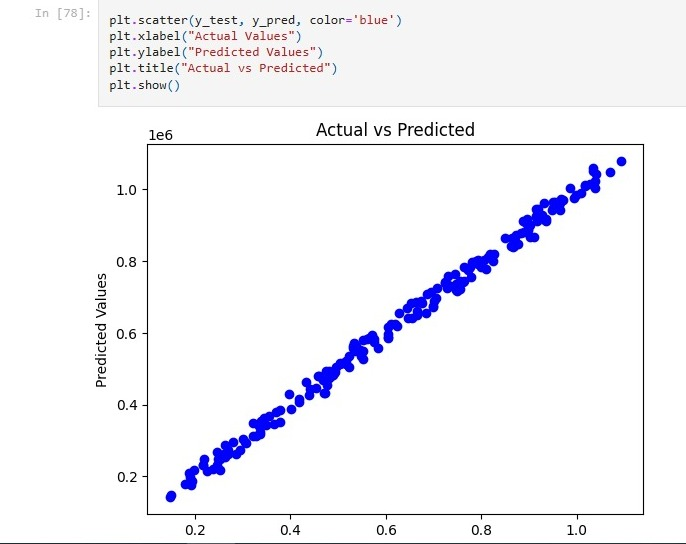

# 📈 Linear Regression Project

A **Machine Learning** project demonstrating **Linear Regression** for predictive analysis oh house rating. This project includes data preprocessing, model training, evaluation, and visualization.

---

## 📊 Overview
Linear Regression is a **supervised learning algorithm** used for predicting continuous values. In this project, we:
- Load and preprocess data.
- Train a **Linear Regression model** using `scikit-learn`.
- Evaluate model performance with **RMSE, R² Score, and MAE**.
- Visualize results using **Matplotlib & Seaborn**.
  
---

## 🔧 Installation
Make sure you have Python installed, then install dependencies using:
```bash
pip install -r requirements.txt
```

# 🚀 Usage

### Run in Jupyter Notebook:

1. Open Jupyter Notebook:
    ```bash
    jupyter notebook
    ```
2. Navigate to `linear_regression.ipynb` and run the cells.

### Run as a Python Script:
```bash
python model.py
```

📌 Results
==========

*   **Predicted vs. Actual Values Plot**
*   **Regression Line on Scatter Plot**

_screenshot_



* * *

📜 Dependencies
===============

*   `numpy`
*   `pandas`
*   `scikit-learn`
*   `matplotlib`
*   `seaborn`

* * *

🤝 Contributing
===============

Feel free to fork this repo, submit PRs, or open issues!

* * *

📩 Contact
==========

For any questions, reach out via:  
📧 Email: `iamaradhya840@gmail.com`  

* * *
